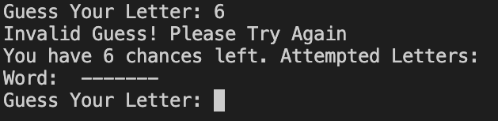
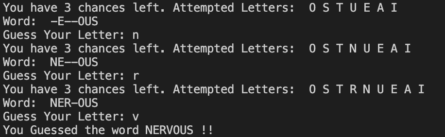

### Hangman

 Hangman is a game to test puzzle solving skills to figure out the word given within kimited guesses. 

 This is a python based game run on the Heroku app. 

## How To Play 

 This game is run exactly like the original game you would have played in school. The user has 6 guesses to figure out the word only being able to guess one letter at a time. The correct letters are then placed where they belong and two are placed in the one guess if there happen to be two of the same letter in the one word. Incorrect guesses or repeated guesses are marked by an error message indicating so. Wrong guesses result in a life lost where as repeated guesses or correct guesses result in no lives lost. 

## Features

 There is a random word selected each time from a library of 1000+ different words. 

 Accepts user input and relays whether the guess is invalid, incorrect, correct or repeated. 

## Testing

 I have manually tested the project through 

- PEP8 linter which confirmed some bugs
- I entered invalid inputs, after which the game showed an error message and required me to try again. I also entered repeated letters for which the game also required a resubmission.
- Tested the code in my local terminal. 

# Future Features

- Adding a visual for the hangman into the terminal.

## Fixed Bugs

- A major bug found was spacing. Errors would show due to the incorrect indentation in my code which was fixed after searching for incorrect indentation.

## Deployment

The code was deployed using Code institutes mock terminal for Heroku.

- Fork or clone the repository
- Create the new heroku app
- Set the buildbacks to Python and NodeJS
- Link the Heroku app to my github repository
- Click on deploy

## Credits

- Code intsitute for the deployment terminal
- Help from https://www.youtube.com/watch?v=6DFZeuD9kVY&ab_channel=NovelTechMedia

